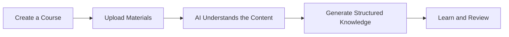
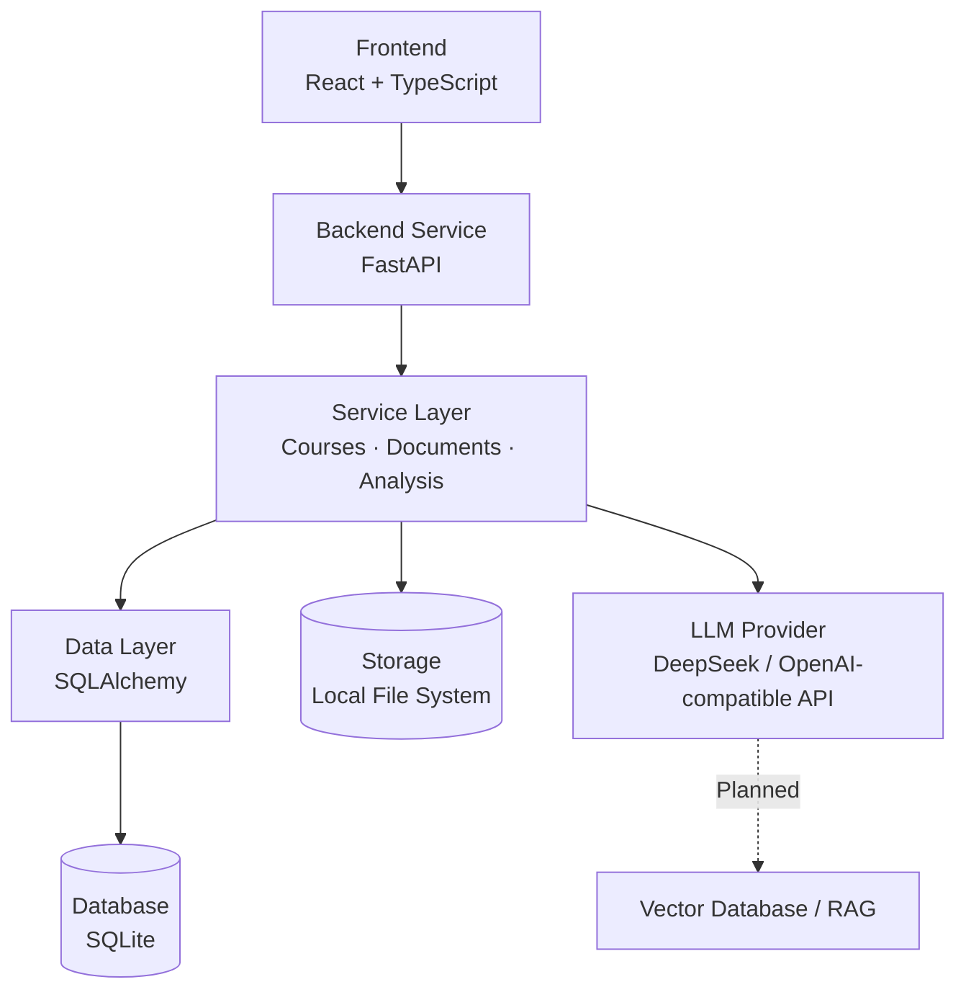
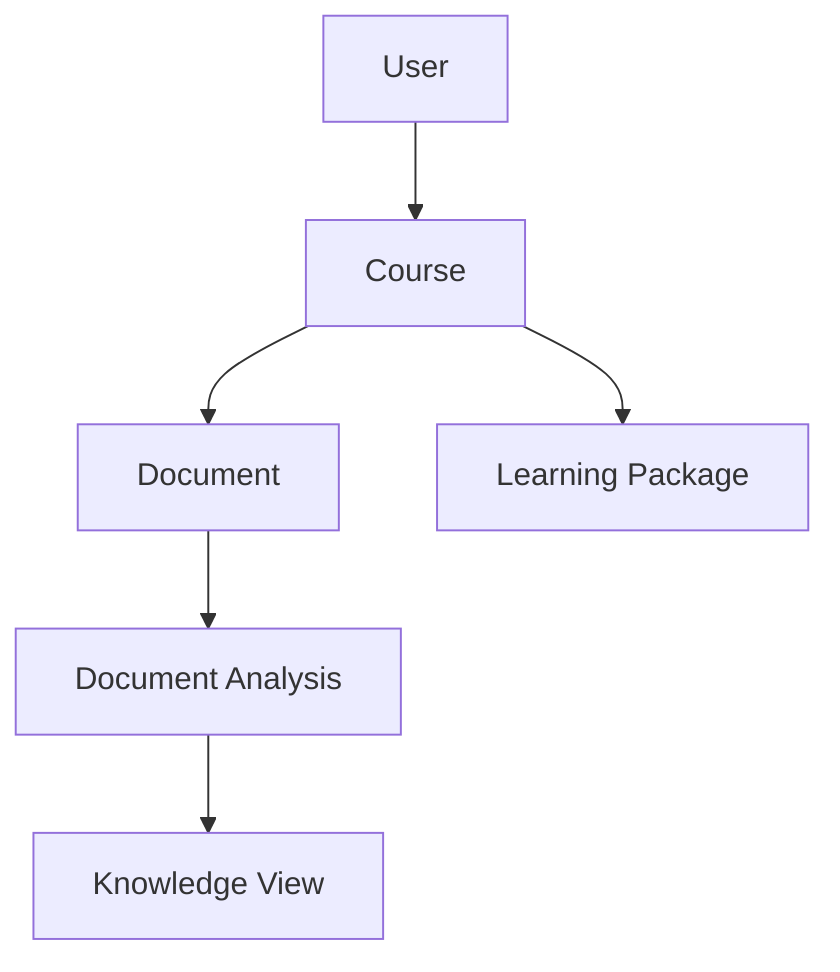

<div align="center">

# Learning OS

## AI 学习操作系统

**AI-powered learning workspace for students.**

An AI learning operating system designed for university students — turning course materials into structured, usable knowledge.

[](#project-status)
[](https://github.com/kongqiuran/learning-os/stargazers)
[](https://www.python.org/)
[](https://react.dev/)

[Website](https://learning-os.cn) · [Repository](https://github.com/kongqiuran/learning-os) · [Website Source](https://github.com/kongqiuran/learning-os-web) · [Author](https://github.com/kongqiuran)

</div>

> [!IMPORTANT]
> Learning OS is currently in **Alpha**. The core product workflow is available for local development and evaluation, while vector search, RAG retrieval, and the AI Tutor remain planned work.

## Product Overview

University students already have plenty of learning material: lecture slides, PDF textbooks, course files, assignments, and personal notes. The real challenge is turning all of it into a clear learning system.

Materials are often scattered, important concepts are hard to identify, manual organization takes time, and revision becomes inefficient. Learning OS is being built to reduce that friction.

A student can:

1. **Create a course workspace** for one subject.
2. **Upload learning materials** such as PDF, PPTX, TXT, and Markdown files.
3. **Let AI process the material** into summaries, topics, and importance signals.
4. **Generate structured learning content** for study and revision.



Learning OS starts with the student's own materials. It does not claim to replace a teacher, and it does not treat general-purpose chat as a complete learning workflow.

## Features

### Available Now

- ✅ **User Authentication** — registration, login, logout, and session recovery
- ✅ **Course Management** — create, view, and delete personal course spaces
- ✅ **Document Upload** — accept text-based PDF, PPTX, TXT, and Markdown files
- ✅ **Document Storage** — persist uploaded files with type and size validation
- ✅ **AI Generation Pipeline** — analyze documents and courses, then generate structured learning packages
- ✅ **Knowledge Management** — present analysis-derived knowledge items and track viewed state
- ✅ **DeepSeek LLM Support** — connect to DeepSeek through the configurable LLM client

The current course assistant uses generated learning packages and document analysis as context. It is **not** a vector-search RAG implementation.

### Roadmap

The following capabilities are **Planned** and should not be considered available today:

- 🚧 Better document parsing and failure recovery
- 🚧 Chunk-based knowledge processing
- 🚧 Embeddings and vector database integration
- 🚧 RAG retrieval with traceable sources
- 🚧 Cross-course personal knowledge spaces
- 🚧 User-level model provider configuration
- 🚧 Personalized learning paths
- 🚧 AI Tutor Agent

## Architecture

Learning OS uses a modular architecture so that the product interface, business workflows, persistence, and model provider can evolve independently.



The backend is organized into three main boundaries:

- **API Layer** — request validation, authentication dependencies, routers, schemas, and response serialization
- **Service Layer** — user, course, document, parsing, analysis, and generation workflows
- **Data Layer** — SQLAlchemy models, database sessions, and local persistence

The repository also retains a Streamlit entry point for a simpler local experience. The React application is the product-oriented frontend.

## Technical Highlights

### Multi-LLM Provider Design

Learning OS is not designed around a single model vendor. Its LLM client uses an OpenAI-compatible Chat Completions interface, allowing the backend to connect to:

- **DeepSeek**
- **OpenAI-compatible APIs**
- **Custom compatible endpoints**

The active provider is selected through environment variables:

```env
LLM_PROVIDER=deepseek
LLM_API_KEY=your_api_key_here
LLM_BASE_URL=https://api.deepseek.com
LLM_MODEL=your_model_name
```

Provider selection is currently configured at the service level. Per-user provider and API key settings are planned.

### Data Architecture

The core domain is centered on four concepts:

- **User** — owns private learning data and authenticated sessions
- **Course** — groups materials and generated learning content by subject
- **Document** — stores uploaded material metadata and processing status
- **Knowledge** — represents structured knowledge associated with a course



The current knowledge workspace maps topics from document analysis into knowledge items. Persistent vector chunks and retrieval indexes do not yet exist.

## Project Structure

The Python backend lives at the repository root and inside `src/`; there is no separate `backend/` directory.

```text
learning-os/
├── api_server.py             # FastAPI application entry point
├── app.py                    # Streamlit local experience
├── frontend/                 # React + TypeScript product frontend
│   └── src/
│       ├── components/       # UI and domain components
│       ├── hooks/            # Server-state hooks
│       ├── lib/              # API client
│       └── pages/            # Authentication, course, and knowledge pages
├── src/
│   ├── ai/                   # LLM client, prompts, analyzers, and generators
│   ├── api/                  # FastAPI routers, schemas, and adapters
│   ├── auth/                 # Password and session helpers
│   ├── database/             # SQLAlchemy base and database connection
│   ├── models/               # User, course, document, and knowledge models
│   ├── services/             # Application services and workflows
│   └── ui/                   # Streamlit UI components
├── data/                     # Local database, uploads, and generated output
├── templates/                # Markdown learning-package templates
├── tests/                    # Backend, API, and AI pipeline tests
├── docker-compose.yml        # Frontend and backend container orchestration
├── Dockerfile                # Python API container
├── DEPLOY.md                 # Alpha deployment guide
└── requirements.txt          # Python dependencies
```

## Quick Start

### Developer Version

Requirements:

- Git
- Python 3.10 or newer
- Node.js 22 and pnpm 11 for the React frontend
- An API key from DeepSeek or another OpenAI-compatible provider

Clone the repository and install the backend:

```powershell
git clone https://github.com/kongqiuran/learning-os.git
cd learning-os
python -m venv .venv
.\.venv\Scripts\Activate.ps1
python -m pip install -r requirements.txt
Copy-Item .env.example .env
python api_server.py
```

On macOS or Linux, activate the environment with `source .venv/bin/activate` and copy the environment file with `cp .env.example .env`.

Start the React frontend in a second terminal:

```powershell
cd learning-os\frontend
corepack enable
pnpm install
pnpm dev
```

- Product frontend: `http://127.0.0.1:5173`
- API documentation: `http://127.0.0.1:8000/api/docs`

### Student-Friendly Version

You do not need to be a software developer to understand the setup:

1. **Install Python.** Python is the program that runs the Learning OS backend and AI workflow. Download Python 3.10 or newer from [python.org](https://www.python.org/downloads/) and enable **Add Python to PATH** during installation.
2. **Download the project.** Use Git, or choose **Code → Download ZIP** on GitHub and extract the folder.
3. **Install the required packages.** On Windows, double-click `install.bat`. This installs the Python libraries used by Learning OS.
4. **Create your private configuration.** Copy `.env.example`, rename the copy to `.env`, and add your own model API key. Never share this file.
5. **Start the simple local interface.** Double-click `start.bat`. This opens the Streamlit experience in your browser.
6. **Create a course and upload materials.** Text-based PDF, PPTX, TXT, and Markdown files are supported. Scanned PDFs and images are not currently processed with OCR.

An **API key** is a private credential that allows Learning OS to call your chosen AI provider. The interface can start without one, but AI generation and course questions require a valid key.

## Configuration

Learning OS needs model configuration because it calls an external LLM provider to analyze and generate content. You choose the provider and retain control of the corresponding API key.

Create `.env` from `.env.example`:

```env
LLM_PROVIDER=deepseek
LLM_API_KEY=your_api_key_here
LLM_BASE_URL=https://api.deepseek.com
LLM_MODEL=your_model_name

DATABASE_URL=sqlite:///data/database/learning_os.db
MAX_UPLOAD_SIZE_MB=50
API_SESSION_SECRET=replace_with_a_long_random_secret
```

| Variable | Purpose |
| --- | --- |
| `LLM_PROVIDER` | Identifies the selected model provider |
| `LLM_API_KEY` | Authenticates requests to that provider |
| `LLM_BASE_URL` | Points to the provider's compatible API endpoint |
| `LLM_MODEL` | Selects the model sent with each request |
| `DATABASE_URL` | Configures the SQLAlchemy database connection |
| `MAX_UPLOAD_SIZE_MB` | Sets the maximum upload size |
| `API_SESSION_SECRET` | Signs browser sessions; use a strong random value in production |

Model names and endpoint URLs can change. Use values currently documented by your provider rather than assuming the example is permanent.

## Deployment

The repository includes an Alpha-oriented container setup:

- **Docker** builds the FastAPI backend and React/Nginx frontend.
- **Docker Compose** connects the services and persists SQLite data and uploads in named volumes.
- **Cloud deployment** can use a single Linux server or compatible container host, with HTTPS and backups configured separately.

See [`DEPLOY.md`](DEPLOY.md) for the current deployment model and security checklist.

This repository does **not** claim that the application is already running as a production SaaS service. A managed SaaS deployment, object storage, scalable databases, and background job infrastructure are future product work.

## Vision

**Learning OS aims to become an AI-native learning platform.**

The long-term goal is to connect course materials, structured knowledge, practice, review, and learning feedback in one coherent workspace — while keeping model providers replaceable and user learning data understandable and controllable.

## Project Status

Learning OS is an evolving open-source product in Alpha. Authentication, course spaces, document storage, AI generation, and knowledge views are implemented. Parsing robustness, vector retrieval, full RAG, OCR, and an autonomous AI Tutor remain under development or planned.

## Contributing

Contributions, product feedback, and real learning scenarios are welcome.

- Open an [Issue](https://github.com/kongqiuran/learning-os/issues) for bugs, questions, or feature proposals.
- Discuss larger changes before implementation so the scope and architecture stay aligned.
- Submit focused Pull Requests with a clear description and verification notes.
- Clearly label planned capabilities; do not present roadmap work as available functionality.

## Links

- Product website: [learning-os.cn](https://learning-os.cn)
- Backend repository: [kongqiuran/learning-os](https://github.com/kongqiuran/learning-os)
- Website repository: [kongqiuran/learning-os-web](https://github.com/kongqiuran/learning-os-web)
- Author: [kongqiuran](https://github.com/kongqiuran)

---

If Learning OS matches a problem you care about, consider starring the repository and sharing how you currently organize your learning materials.
