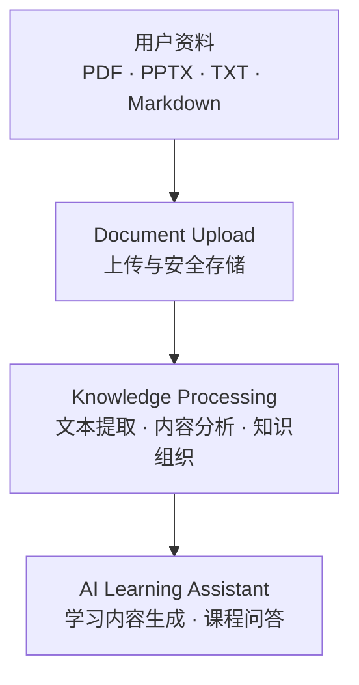
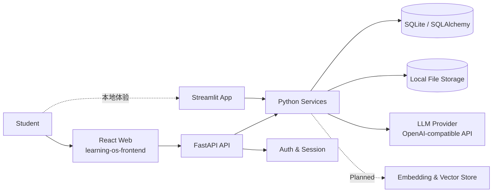

<div align="center">

# Learning OS

**An AI-powered learning workspace that transforms study materials into structured knowledge.**

把散落的 PDF、PPT 和笔记，变成可理解、可复习、可持续积累的个人学习空间。

[](#项目状态)
[](https://github.com/kongqiuran/learning-os/stargazers)
[](https://www.python.org/)
[](https://react.dev/)


[功能](#功能) · [技术架构](#技术架构) · [快速开始](#快速开始) · [Roadmap](#roadmap) · [参与贡献](#参与贡献)

</div>

> [!IMPORTANT]
> Learning OS 目前处于 **Alpha** 阶段，适合本地体验与开发验证，尚未承诺生产级稳定性。Embedding、向量检索与完整 RAG 知识库仍在规划中。

## 为什么是 Learning OS

学生真正缺少的通常不是更多资料，而是一个能把资料转化为学习行动的系统：课程文件散落在不同位置，PDF 和 PPT 越积越多，重点难以识别，复习也常常从头翻起。

Learning OS 从学习者的资料出发，尝试建立一条清晰的 AI 学习链路：

```text
上传资料 → 提取与理解 → 组织知识 → 生成学习内容 → 辅助复习与问答
```

它不会预置一套与课程无关的“标准答案”，而是围绕用户自己的学习材料构建课程空间。长期目标是让每位学习者都拥有一个可持续积累、可选择模型、可追溯来源的 AI 学习工作台。

## 产品流程



## 功能

### 已实现

- ✅ **用户认证**：注册、登录、退出与会话恢复
- ✅ **课程空间**：创建、浏览和删除个人课程
- ✅ **文档管理**：上传、查看和删除课程资料
- ✅ **文件存储**：本地持久化上传文件，限制文件类型与大小
- ✅ **文本提取**：支持文本型 PDF、PPTX、TXT 与 Markdown
- ✅ **AI 内容分析**：对资料进行摘要、主题和重要度分析
- ✅ **学习内容生成**：按课程生成结构化学习包，并记录任务状态
- ✅ **知识工作区**：从文档分析结果展示知识条目与阅读状态
- ✅ **课程问答**：基于已生成的课程内容和资料分析结果回答问题
- ✅ **基础 SaaS 架构**：React 前端、FastAPI API、SQLAlchemy 数据模型与 SQLite

### 开发中 / Planned

- 🚧 更稳定的长文档解析与分段策略
- 🚧 Chunk 持久化、Embedding 与向量检索
- 🚧 完整 RAG Pipeline 与可追溯引用
- 🚧 个人知识库与跨课程知识关联
- 🚧 用户级 AI Provider 与模型配置
- 🚧 个性化学习路径与进度建议
- 🚧 OCR、图片及公式识别

> 当前课程问答使用已生成的学习包和文档分析结果作为上下文，并不是完整的向量检索 RAG。仓库中的向量存储接口仍为预留实现。

## 技术架构

| 层级 | 当前实现 | 职责 |
| --- | --- | --- |
| Frontend | React 19、TypeScript、Vite、TanStack Query | 产品界面、路由与服务端状态管理 |
| Backend | Python、FastAPI | 认证、课程、文档、知识与 AI 接口 |
| Database | SQLAlchemy、SQLite | 用户、课程、文档、分析与学习包数据 |
| AI Layer | OpenAI-compatible Chat Completions API | 文档分析、课程分析、内容生成与问答 |
| Storage | 本地文件系统；对象存储待扩展 | 上传文件、数据库与生成结果持久化 |
| Legacy UI | Streamlit | 保留的本地单体体验入口 |



## 项目结构

当前仓库没有单独的 `backend/` 目录；Python 后端入口位于项目根目录，核心代码集中在 `src/`。以下结构均来自当前仓库：

```text
learning-os/
├── api_server.py             # FastAPI 服务入口
├── app.py                    # Streamlit 本地体验入口
├── frontend/                 # React + TypeScript 产品前端
│   └── src/
│       ├── components/       # 通用组件与业务组件
│       ├── hooks/            # 数据请求 Hooks
│       ├── lib/              # API Client
│       └── pages/            # 登录、课程、知识与设置页面
├── src/                      # Python 后端与 AI 核心
│   ├── ai/                   # LLM Client、Prompt、分析器与生成器
│   ├── api/                  # FastAPI Router、Schema 与 Adapter
│   ├── auth/                 # 密码与会话能力
│   ├── database/             # 数据库连接与 Base
│   ├── models/               # SQLAlchemy 数据模型
│   ├── services/             # 用户、课程、文档与分析服务
│   └── ui/                   # Streamlit UI 组件
├── data/                     # 本地数据库、上传与输出目录
├── templates/                # 学习包 Markdown 模板
├── tests/                    # 后端与 API 自动化测试
├── docker-compose.yml        # 前后端容器编排
├── Dockerfile                # Python API 镜像
└── requirements.txt          # Python 依赖
```

## 快速开始

### 环境要求

- [Git](https://git-scm.com/)
- Python 3.10 或更高版本（容器环境使用 Python 3.13）
- Node.js 22 与 pnpm 11（仅运行 React 前端时需要）
- 一个可用的 OpenAI-compatible API Key（生成和问答功能需要）

### 1. 获取项目并安装后端

```powershell
git clone https://github.com/kongqiuran/learning-os.git
cd learning-os
python -m venv .venv
.\.venv\Scripts\Activate.ps1
python -m pip install -r requirements.txt
```

macOS / Linux 激活虚拟环境时，请使用 `source .venv/bin/activate`。

### 2. 配置环境变量

复制 `.env.example` 并命名为 `.env`。`.env` 是只在本机保存的配置文件，用于存放 API Key、模型地址、数据库位置等敏感或因环境而异的设置；它已被 Git 忽略，请勿上传或分享。

Windows PowerShell：

```powershell
Copy-Item .env.example .env
```

最小模型配置示例：

```env
LLM_PROVIDER=deepseek
LLM_API_KEY=your_api_key_here
LLM_BASE_URL=https://api.deepseek.com
LLM_MODEL=your_model_name
```

> 请使用供应商当前提供的有效模型名称。项目实际读取的是 `LLM_API_KEY` 和 `LLM_BASE_URL`，而不是 `OPENAI_API_KEY` 或 `MODEL_BASE_URL`。

### 3. 启动后端

```powershell
python api_server.py
```

后端默认运行在 `http://127.0.0.1:8000`，API 文档位于 `http://127.0.0.1:8000/api/docs`。

### 4. 启动 React 前端

新开一个终端窗口：

```powershell
cd frontend
corepack enable
pnpm install
pnpm dev
```

访问 `http://127.0.0.1:5173`。开发服务器会把 `/api` 请求代理到本地 FastAPI 服务。

### 更简单的本地体验

Windows 用户也可以双击 `install.bat` 安装 Python 依赖，再双击 `start.bat` 启动保留的 Streamlit 入口。该入口适合快速体验，不等同于完整 React 产品界面。

### Docker 部署

仓库提供 `docker-compose.yml`，可构建 React/Nginx 前端和 FastAPI 后端。当前部署方案使用 SQLite 与本地持久化卷，适合 Alpha 阶段的单机部署；生产配置与安全检查见 [`DEPLOY.md`](DEPLOY.md)。

## 配置说明

Learning OS 的模型层遵循 **Provider 可替换** 的设计：业务逻辑依赖 OpenAI-compatible API，而不是绑定某一家模型厂商。这样既能使用 OpenAI 或 DeepSeek，也能接入其他兼容服务，并为未来的用户自定义 API 留出空间。

| 变量 | 用途 | 示例 |
| --- | --- | --- |
| `LLM_PROVIDER` | Provider 标识，用于区分配置 | `deepseek` / `openai` / `custom` |
| `LLM_API_KEY` | 模型服务密钥 | `your_api_key_here` |
| `LLM_BASE_URL` | OpenAI-compatible API 地址 | `https://api.openai.com/v1` |
| `LLM_MODEL` | 实际调用的模型名称 | 由 Provider 提供 |
| `LLM_TIMEOUT_SECONDS` | 单次请求超时时间 | `120` |
| `LLM_MAX_ATTEMPTS` | 失败后的最大尝试次数 | `3` |
| `DATABASE_URL` | SQLAlchemy 数据库连接 | `sqlite:///data/database/learning_os.db` |
| `API_SESSION_SECRET` | Web 会话签名密钥 | 生产环境使用至少 32 位随机值 |
| `MAX_UPLOAD_SIZE_MB` | 单文件上传限制 | `50` |

当前模型配置是服务级环境变量。让每位用户在界面中独立选择 Provider、模型和 API Key，属于后续版本计划。

## Roadmap

| 版本 | 主题 | 范围 | 状态 |
| --- | --- | --- | --- |
| V1 | SaaS 基础与 AI 学习闭环 | 用户、课程、上传、解析、AI 分析、学习包与基础问答 | Alpha / 已实现 |
| V2 | AI 文档理解 | 更稳定的解析、Chunk、Embedding、向量检索与引用 | Planned |
| V3 | 个人知识库 | 跨文档与跨课程知识组织、用户级多模型配置 | Planned |
| V4 | AI Learning Agent | 个性化学习路径、主动复习建议与 AI Tutor Agent | Vision |

### 近期

- 完成长文档 Chunk 与 Embedding 流程
- 建立可验证、可追溯的 RAG 知识库
- 补强解析失败处理与知识来源引用

### 中期

- 构建跨课程的个人学习空间
- 支持用户级多模型与自定义 API 配置
- 引入学习进度、掌握度与复习计划

### 长期

- 打造理解课程材料、学习目标与个人节奏的 AI Tutor Agent
- 从“回答问题”升级为“规划、陪练、反馈、迭代”的完整学习协作体验

## Vision

**Learning OS aims to become an AI-native learning platform.**

我们希望把 AI 从一个临时问答工具，变成连接资料、知识、练习与成长反馈的学习基础设施。项目将持续以开放、可替换和用户数据可控为方向演进。

## 项目状态

当前版本定位为 Alpha：核心架构和本地学习闭环已经建立，但 RAG、OCR、对象存储、分布式任务处理以及大规模生产验证尚未完成。欢迎通过 Issue 反馈真实学习场景和使用问题。

## 参与贡献

欢迎参与 Learning OS 的设计与开发：

- 使用 [Issues](https://github.com/kongqiuran/learning-os/issues) 报告问题或提出功能建议
- 在修改前通过 Issue 说明目标与范围，便于提前对齐设计
- 提交小而清晰的 Pull Request，并附上验证方式
- 新功能请明确区分“当前可用”与“规划能力”，避免误导用户

## 联系方式

- 作者：[kongqiuran](https://github.com/kongqiuran)
- 项目主页：[github.com/kongqiuran/learning-os](https://github.com/kongqiuran/learning-os)

---

如果这个方向对你有帮助，欢迎 Star 项目并分享你的学习场景。
