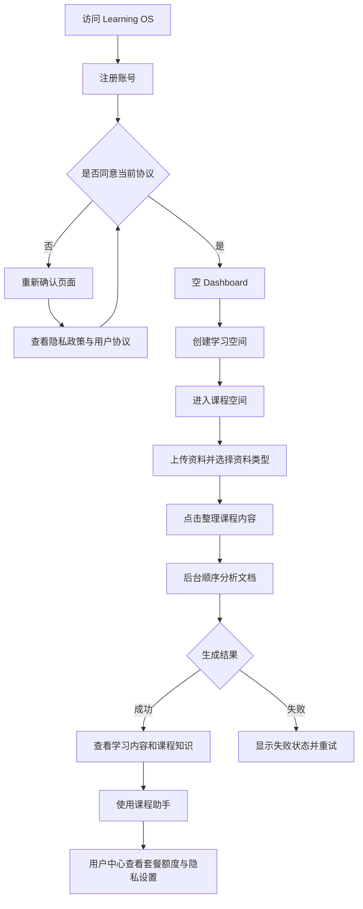

# Learning OS Step11-1 新用户体验审计报告

## 1. 审计范围与证据边界

本次按“完全不了解 Learning OS 的大学生”视角检查注册、登录、创建课程、上传资料、AI 整理、内容阅读、课程助手和用户中心。

证据包括：

- 生产环境健康接口、隐私版本接口及公开法律页面 HTTP 验证；
- React 前端页面、交互状态和错误文案逐项检查；
- 认证、上传、生成、助手、额度和注销 API 代码检查；
- 当前 114 项自动化测试及已有多用户隔离测试。

限制：浏览器自动化连接公开域名连续超时，因此本报告没有声称完成真实生产账号注册、真实大文件上传或真实模型计费测试。视觉与交互结论来自生产构建对应代码和接口证据，真实学生行为仍需在 Step11-6 验证。

## 2. 新用户流程图

## 3. 分步骤评分

| 步骤 | 评分 | 做得好的地方 | 主要问题 |
|---|---:|---|---|
| 注册账号 | 3/5 | 表单字段少；两次密码不一致可即时提示；注册后自动登录 | 没有密码强度要求；注册页没有协议说明；新用户首次进入看到“隐私政策已更新”，语义上像老用户升级而不是首次授权 |
| 登录 | 4/5 | 登录失败提示明确；Session 自动恢复；受保护页面会带回原路径 | 没有“忘记密码”；没有显示会话有效期；错误只区分凭据错误，缺少频繁失败反馈 |
| 创建学习空间 | 4/5 | 空状态和主按钮明显；课程名称示例清楚；描述为可选 | “学习空间”和“课程”的叫法交替使用；创建成功后仍停留 Dashboard，需要用户再点课程卡才能进入下一步 |
| 上传资料 | 2/5 | 支持 PDF/PPTX/TXT/MD；有大小、MIME、文件签名检查；空课程有上传按钮 | 必须先理解 document_type；默认是“其他资料”，会降低后续分析权重；不支持 DOCX、图片和扫描 PDF OCR；前端没有显示 50MB 上限；上传成功后没有解释下一步 |
| AI 整理 | 3/5 | 按钮在无资料时禁用；pending/processing 状态稳定；提示可离开页面；失败可重新整理 | 只显示“正在整理”，没有阶段或已完成文档数；后台任务不耐进程重启；失败文案让普通用户“检查模型配置”不合理；最长等待时间不可预测 |
| 学习内容查看 | 4/5 | 结构包含章节、公式、重点、练习和计划；Markdown 阅读支持列表、代码、表格；布局稳定 | 长内容全部纵向展开，缺目录、折叠和返回顶部；生成证据与原文定位较弱；移动端长表格与大量卡片仍需真机验证 |
| AI 助手 | 3/5 | 明确说明仅依据课程资料；空上下文返回固定提示；展示来源文件或来源说明 | 无资料时仍展示输入框，用户要提交后才知道信息不足；没有示例问题；每次问答都是新的模型调用且没有用户级每日请求额度 |
| 用户中心 | 4/5 | 套餐、课程数、AI 次数、协议、退出和注销集中展示；注销确认充分 | Free 套餐没有列出完整限制；“升级方案”仍是占位提醒；隐私版本读取失败时只显示“正在读取”；没有数据导出能力 |

综合评分：**3.4/5**。产品主闭环已经存在，但新用户在“首次授权—资料分类—等待 AI”三个节点缺少连续指导。

## 4. 阻塞问题

### P0：首次注册后的协议页面语义错误

新用户没有任何历史授权，也会看到“隐私政策已更新”。这会让用户误以为系统错误地把自己识别为老用户。应根据是否存在任何历史授权区分“首次使用确认”和“版本更新确认”。

### P0：扫描版 PDF 在生成阶段才失败

上传接口只验证文件格式和签名，不检查能否提取文字。扫描教材可以成功上传，但在用户等待 AI 整理后才得到“No text was found / OCR is not supported”。这是完整流程阻塞，应在上传后快速预检，或至少在上传界面明确说明暂不支持扫描件。

### P1：资料类型选择成本高且默认值不利

当前默认 `OTHER` 权重最低。不了解分类的学生最可能保留默认值，实际会直接影响课程分析优先级。应改为可理解的分类入口，让选择动作等同于“上传教材/课件/笔记/试卷”。

### P1：后台任务不具备部署与进程异常恢复能力

生成运行在 FastAPI `BackgroundTasks` 中。容器重启或进程退出会中断任务，数据库可能长期停在 pending/processing。对真实付费用户，这是可靠性阻塞。

### P1：生成反馈缺少阶段与时间预期

后端已经保存 `current_stage` 和 `retry_count`，前端类型也接收这些字段，但用户界面只显示统一“正在整理”。文档多时用户无法判断是否卡住。

## 5. 高优先级优化建议

1. **立即完成 Step11-4 分类上传入口**：四个主要入口直接绑定 TEXTBOOK、SLIDES、NOTES、EXAM，同时保留 HOMEWORK/OTHER 兼容入口。
2. **立即完成 Step11-5 非阻塞引导**：首次空 Dashboard 展示三步路线；课程空状态直接提供“上传教材”；学习内容空状态提供明确生成动作。
3. **修正授权页面标题**：无任何授权记录显示“开始使用前请确认”，存在旧授权才显示“隐私政策已更新”。此项不纳入 Step11-5，避免扩展实现范围。
4. **上传后文本预检**：保存后异步检查可提取文本；扫描 PDF 提前提示需要文字版或 OCR。
5. **展示真实生成阶段**：把 document_analyzer、course_analyzer、learning_package_generator 映射为学生可理解的三段进度。
6. **将后台任务迁移到持久队列**：至少提供任务心跳、超时失败和启动恢复，再扩大真实用户规模。
7. **改写技术化错误文案**：用户只看到可执行动作，模型配置细节留在服务端日志。

## 6. Step11-4/11-5 验收指标

- 新用户从空 Dashboard 到打开上传弹窗不超过 2 次点击；
- 主要资料类型无需下拉框识别；
- 默认上传不再落入 OTHER；
- 无课程、无资料、无学习内容三个空状态都有唯一主动作；
- 引导可以关闭，已有课程用户完全不显示；
- 不修改上传 API、document_type 数据结构和 AI 生成逻辑。
