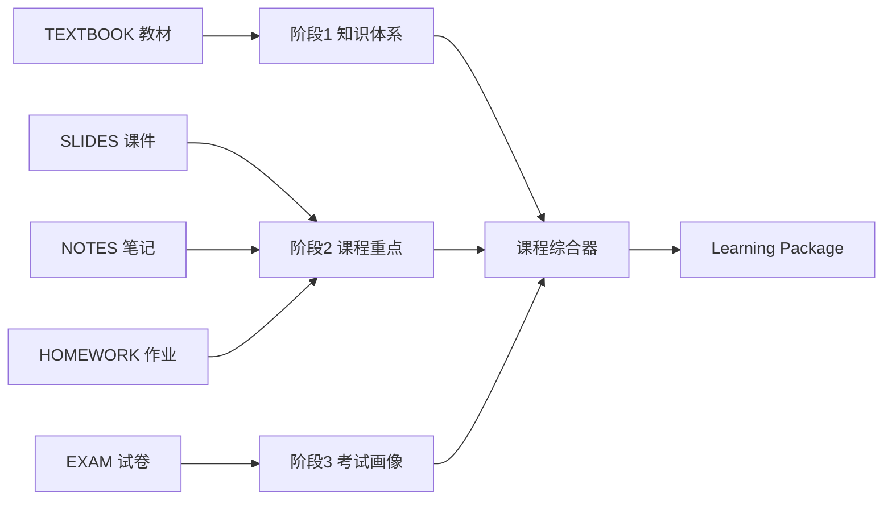

# Learning OS Step11-3 多阶段 AI 分析架构设计报告

## 1. 设计目标

把当前“所有 DocumentAnalysis 一次汇总成 CourseAnalysis，再生成 LearningPackage”的重型流程，拆成可增量缓存、可独立失败、可解释的三阶段分析，同时保持现有课程、文档、学习包和公开 API 可用。



缺少某类资料时不阻塞：只有教材则生成知识型学习包；没有试卷则明确“暂无真实考试证据”，禁止虚构题型预测。

## 2. 三阶段输入输出契约

### 阶段1：教材分析 `knowledge_structure`

输入：TEXTBOOK；必要时 OTHER 中由用户明确标记为参考书的资料。

输出：

- chapters：章节层级、顺序和来源；
- concepts：定义、核心解释、先修依赖；
- formulas：公式、变量、条件和适用场景；
- knowledge_dependencies：知识依赖边；
- examples：教材例题方法，不生成新题。

### 阶段2：课程资料分析 `course_signals`

输入：SLIDES、NOTES、HOMEWORK；OTHER 作为低权重补充。

输出：

- teacher_focus：老师重复、强调和课堂范围；
- coverage：已讲/未讲/资料不足；
- exercise_directions：作业方法、常见要求；
- supplemental_explanations：笔记补充解释和记忆提示；
- evidence：每个结论对应 document_id 和可定位片段。

### 阶段3：考试分析 `exam_signals`

输入：EXAM；模拟题必须在元数据中区分，避免当作历年真题。

输出：

- recurring_topics：带样本次数的高频考点；
- question_types：实际出现题型和设问方式；
- difficulty_distribution：仅依据样本描述；
- common_traps：真实题目暴露的易错点；
- sprint_plan：基于阶段1/2交集生成的冲刺计划；
- confidence：样本数量不足时降低置信度，不输出确定性预测。

## 3. 数据模型设计

保留现有 `DocumentAnalysis` 和 `LearningPackage`。新增统一阶段产物模型：

### `CourseAnalysisArtifact`

| 字段 | 用途 |
|---|---|
| id | 主键 |
| user_id | 后台任务纵深隔离与查询索引 |
| course_id | 所属课程 |
| artifact_type | knowledge_structure / course_signals / exam_signals / synthesis |
| version | 同类型递增版本 |
| status | pending / processing / completed / failed |
| input_fingerprint | 输入 document_id、内容哈希、分析器版本的稳定哈希 |
| prompt_version | Prompt 契约版本 |
| content_json | 阶段结构化输出 |
| source_document_ids | 输入文档 ID 列表 |
| usage_json | 模型、token、缓存、费用、耗时、重试 |
| error_json | 可恢复错误和内部诊断 |
| created_at / completed_at | 生命周期时间 |

约束建议：`course_id + artifact_type + version` 唯一；所有后台更新必须同时绑定 artifact_id、course_id、user_id。

Document 增加内容哈希可以延后到 MVP 第二阶段；MVP 可先用 `document_id + uploaded_at + file_size` 形成 fingerprint。

## 4. Prompt 组织方式

```text
document extractor（按类型）
        ↓ 小而稳定的 DocumentAnalysis
stage aggregator（每个阶段独立 Prompt）
        ↓ CourseAnalysisArtifact
synthesis prompt（只接收三个阶段的压缩 JSON）
        ↓ LearningPackage
```

原则：

1. 每个 Prompt 有 JSON Schema、版本号、最大输入和最大输出；
2. 统一启用模型原生 JSON Output；
3. 证据字段只引用真实 document_id/片段，不允许自由生成来源；
4. 阶段输出采用稳定字段，最终学习包不再接收所有文档分析全文；
5. fingerprint 未变化时复用阶段产物；新增一份试卷只重算阶段3和 synthesis；
6. 无考试材料时 synthesis 必须输出“不具备题型预测依据”。

## 5. API 设计

MVP 新增但不立即删除旧接口：

```text
POST /api/courses/{course_id}/analysis/generate
GET  /api/courses/{course_id}/analysis/status
GET  /api/courses/{course_id}/analysis/artifacts
```

生成响应：

```json
{
  "task_id": 123,
  "status": "pending",
  "stages": [
    {"name": "knowledge_structure", "status": "pending"},
    {"name": "course_signals", "status": "pending"},
    {"name": "exam_signals", "status": "skipped"},
    {"name": "synthesis", "status": "pending"}
  ]
}
```

兼容层：现有 `POST /learning-package/generate` 内部调用新 orchestrator，响应仍返回 LearningPackage task；现有轮询接口继续工作，避免一次同时修改前后端协议。

## 6. 前端设计

课程空间保持现有稳定布局，只增强学习内容区域：

- 上传区按教材、课件、笔记、作业、试卷分类；
- 生成状态显示“建立知识体系 → 提取课堂重点 → 分析考试资料 → 生成学习包”；
- 缺少某类资料时显示“未提供试卷，本次不做考试趋势判断”，不是错误；
- 学习内容增加四个入口：知识体系、课程重点、考试分析、复习计划；
- 重新生成前提示哪些阶段会复用、哪些会更新；
- 不让阶段状态切换卸载整个课程页面。

## 7. 老用户兼容方案

1. 旧 Document、DocumentAnalysis、LearningPackage 原样保留，不做破坏性迁移。
2. 打开旧课程时继续展示最新 completed LearningPackage。
3. 用户下一次点击“重新整理”时，按现有 document_type 构建首批阶段 artifact。
4. 旧 `OTHER` 文档进入阶段2低权重输入，不自动猜测为教材或试卷。
5. 阶段生成失败时保留旧 completed LearningPackage，不用 failed 新版本覆盖可用内容。
6. 新 API 稳定并完成灰度后，再考虑下线旧 CourseAnalyzer 内部路径；公开路由保持兼容至少一个版本周期。

## 8. 失败、事务与任务恢复

- 每个 stage 独立落库，失败只标记当前 stage；
- synthesis 只读取同一 task 固定版本的 completed artifacts，禁止混用新旧结果；
- 队列消息携带 task_id、course_id、user_id，Service 再次校验三元组；
- 任务有 heartbeat_at 和 expires_at，超时任务自动转 failed/retryable；
- 模型调用前预留额度，只有不可开始的任务释放额度；已产生实际模型成本的失败任务记录消耗和补偿策略；
- 所有 usage 按 stage 落库，支持成本审计。

## 9. MVP 实现顺序

1. **观测先行**：LLMClient 返回并保存 usage、耗时、重试；不改变输出。
2. **新增 artifact 模型**：只建表和 Service，现有生成仍可用。
3. **阶段1/2 聚合**：先解决教材与课堂资料，不做预测。
4. **阶段3 考试分析**：加入样本数量和置信度约束。
5. **兼容 orchestrator**：旧生成 API 切到阶段产物 + synthesis。
6. **前端阶段进度**：映射真实后端状态。
7. **持久队列与恢复**：在扩大 Beta 前完成。
8. **灰度与回滚**：按课程启用 feature flag，旧路径保留一轮。

## 10. 明确不在 Step11-4/11-5 实现的内容

Step11-4 只优化上传分类入口，Step11-5 只做非阻塞引导和空状态。两步均不得提前修改 AI Prompt、分析模型、数据库或生成 API；多阶段架构必须作为后续独立开发项目执行。
