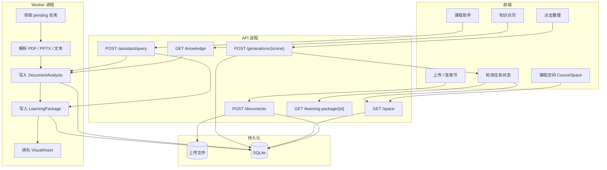

# 文档交互与接口链路

本文按**当前线上实现**梳理：从前端操作到 API、Worker、文档解析、学习包、知识点和课程助手。Step11-3 里设计的 `POST /analysis/generate` 尚未落地，不要按那份设计稿理解现网。

## 1. 一句话

用户先把资料挂到课程上；点击某个场景的「整理」后，API 只创建 `LearningPackage` 任务并预扣额度；`worker` 领取任务后才解析文档、写入 `DocumentAnalysis`、生成学习包，再派生知识点和配图。

生产环境三个常驻服务：`frontend`、`backend`（只接请求、写任务）、`worker`（真正跑 AI）。测试环境才会在 API 进程里用 `BackgroundTasks` 同步执行生成。

## 2. 文档从进系统到被用上

资料本身**不会在上传时分析**。上传成功后 `documents.status` 是 `uploaded`；解析发生在生成任务里。

| 步骤 | 谁触发 | 发生了什么 | 关键对象 |
|---|---|---|---|
| 1. 上传 | 课程空间选类型后选文件 | 校验扩展名 / MIME / 文件头 / 大小，落到用户课程目录，写 `Document` | `Document`，`status=uploaded` |
| 2. 挂章节 | 上传时带 `chapter_id`，或之后拖动 | 只改 `Document.chapter_id`，不重解析 | 跟课整理按章节取资料 |
| 3. 创建整理任务 | 用户点跟课 / 教材 / 考试整理 | 预扣额度，写入 `LearningPackage(status=pending)` | 场景 + 范围必须合法 |
| 4. Worker 领取 | 独立进程每轮扫 `pending` | 改为 `processing`，写心跳 | 心跳超过 90 秒会恢复，最多两轮 |
| 5. 单文档理解 | `analyze_course` 遍历范围内文档 | 已有分析且流水线版本未变则复用；否则解析再调 LLM | `DocumentAnalysis` 一对一绑定文档 |
| 6. 合成学习包 | 同一任务内 | 跟课章节走 `follow_chapter_generator`；教材/考试走课程分析 + 学习包生成 | `LearningPackage.content_json` |
| 7. 派生 | 学习包成功后 | 知识点从 `DocumentAnalysis.topics` 现算；配图另排 `VisualAsset` | 配图失败不影响学习包 |

### 2.1 上传约束

- 格式：`.pdf` / `.pptx` / `.txt` / `.md`
- 类型：`TEXTBOOK` / `SLIDES` / `EXAM` / `HOMEWORK` / `NOTES` / `OTHER`
- 所有权：`user_id + course_id` 必须同时匹配
- 删除：删库记录、原文件和派生页图；知识点会因 `DocumentAnalysis` 级联消失

### 2.2 单文档解析两条路

PDF 且视觉能力开启时走文档智能流水线：分页 → 判断是否需要视觉 → 可选视觉理解 → `document_analyzer`。其它格式只抽文本再分析。分析成功后 `documents.status=completed`。缓存键是「同一文档已有 `DocumentAnalysis`，且 PDF 流水线版本未升级」。

### 2.3 场景怎么圈资料

| 场景 | 前端入口 | 允许的资料类型 | 范围规则 |
|---|---|---|---|
| `follow` 跟课 | 章节或未分章资料 | `SLIDES`、`HOMEWORK`、`OTHER`、`NOTES` | 必须指定一个 `chapter_id`，或 `scope_unassigned=true` |
| `textbook` 教材 | 某一份教材 | `TEXTBOOK` | 必须指定 `scope_document_id` |
| `exam` 考试 | 整门课 | `EXAM`、`HOMEWORK` | 不能带章节或单文档范围 |
| `legacy` | 旧接口整课整理 | 课程下全部资料 | 走免费月额度，不走单课权益 |

资料增删或改类型后，已完成学习包会标 `is_stale`（来源指纹变化），需要重新整理。

## 3. 前端怎么跟这些接口说话

课程空间一次拉齐展示数据，之后用 mutation 改状态，用轮询看生成进度。

| 前端方法 | 页面用途 | 后端 |
|---|---|---|
| `api.courseSpace` | 课程空间主查询；有进行中任务时每 2 秒刷新 | `GET /api/courses/{id}/space` |
| `api.uploadDocument` | XMLHttpRequest 上报进度 | `POST /api/courses/{id}/documents` |
| `api.deleteDocument` | 删除资料 | `DELETE /api/courses/{id}/documents/{id}` |
| `api.moveDocument` | 改章节 | `PATCH /api/courses/{id}/documents/{id}/chapter` |
| `api.generateScene` | 三场景整理 | `POST /api/courses/{id}/generations/{scene}` |
| `api.learningPackageTask` | 排队中每 1 秒、运行中每 2 秒 | `GET /api/courses/{id}/learning-package/{id}` |
| `api.queryCourseAssistant` | 当前场景/章节/教材范围内问答 | `POST /api/courses/{id}/assistant/query` |
| `api.courseKnowledge` | 知识点列表 | `GET /api/courses/{id}/knowledge` |

`GET /space` 返回：课程、资料、章节、最新/已完成的场景包、章节包、教材包。前端用 `scene_packages` / `chapter_packages` / `document_packages` 判断是否还有 `pending` 或 `processing`。

## 4. 接口清单

认证方式：session cookie `learning_os_session`。除健康检查外，下列接口都要登录。OpenAPI：`/api/docs`。

### 4.1 课程与资料（文档主链路）

| 方法 | 路径 | 作用 | 成功码 |
|---|---|---|---|
| GET | `/api/dashboard` | 首页课程摘要 | 200 |
| GET | `/api/courses` | 课程列表 | 200 |
| POST | `/api/courses` | 建课 | 201 |
| GET | `/api/courses/{course_id}` | 课程详情 | 200 |
| DELETE | `/api/courses/{course_id}` | 删课 | 200 |
| GET | `/api/courses/{course_id}/space` | 课程空间聚合 | 200 |
| POST | `/api/courses/{course_id}/documents` | 上传资料（multipart：`file`、`document_type`、可选 `chapter_id`） | 201 |
| DELETE | `/api/courses/{course_id}/documents/{document_id}` | 删除资料 | 200 |
| PATCH | `/api/courses/{course_id}/documents/{document_id}/chapter` | 移动资料到章节或取消分章 | 200 |
| GET | `/api/courses/{course_id}/chapters` | 章节列表 | 200 |
| POST | `/api/courses/{course_id}/chapters` | 新建章节 | 201 |
| PATCH | `/api/courses/{course_id}/chapters/{chapter_id}` | 改标题或顺序 | 200 |
| DELETE | `/api/courses/{course_id}/chapters/{chapter_id}` | 删章节；body 必须带 `material_action=keep_unassigned` 或 `delete` | 200 |

上传失败常见 `400 invalid_document`。无权或找不到是 `404 course_not_found` / `document_not_found`。

### 4.2 生成、助手、知识、配图

| 方法 | 路径 | 作用 | 成功码 |
|---|---|---|---|
| POST | `/api/courses/{course_id}/generations/{scene}` | 排队生成。query：`scope_document_id` / `scope_chapter_id` / `scope_unassigned` | 202 |
| POST | `/api/courses/{course_id}/learning-package/generate` | 旧整课生成，走免费月额度 | 202 |
| GET | `/api/courses/{course_id}/learning-package/{package_id}` | 单任务状态 | 200 |
| POST | `/api/courses/{course_id}/assistant/query` | 课程问答 | 200 |
| GET | `/api/courses/{course_id}/knowledge` | 该课全部知识点 | 200 |
| GET | `/api/knowledge/{knowledge_id}` | 知识点详情。ID 形如 `analysis-{分析ID}-topic-{序号}` | 200 |
| PATCH | `/api/knowledge/{knowledge_id}/viewed` | 标记已读 | 200 |
| GET | `/api/visual-assets/{target_type}/{target_id}` | 查配图 | 200 |
| POST | `/api/visual-assets/{target_type}/{target_id}` | 请求生成配图 | 202 |

生成相关错误：

- `409 generation_in_progress`：同一课程+场景+范围已有进行中任务
- `400 invalid_generation_scope`：范围不符合场景规则，或范围内没有资料
- `429 insufficient_credits`：免费月额度或单课权益不足；响应里带 `quota_source`、`purchase_url`

额度规则：课程有生效权益时扣 `follow` / `textbook` / `exam` / `assistant` 对应次数；否则扣免费月额度。任务最终失败会返还。Worker 心跳丢失两次也返还。

助手上下文优先级：当前范围的已完成学习包章节 → 同范围 `DocumentAnalysis`。资料不够时固定回答「当前课程资料中没有足够信息。」

知识点**没有独立表**。列表是把每份 `DocumentAnalysis.topics` 展开成 `analysis-{id}-topic-{index}`。没跑过整理的资料不会出现知识点。

### 4.3 账号、计费、系统（旁路，不参与文档解析）

| 方法 | 路径 | 作用 |
|---|---|---|
| POST | `/api/auth/register` `/login` `/logout` | 注册登录退出 |
| GET | `/api/auth/me` | 当前用户 |
| DELETE | `/api/account` | 注销 |
| GET | `/api/privacy/current` `/status` | 隐私政策 |
| POST | `/api/privacy/consent` | 同意隐私政策 |
| GET | `/api/billing/products` `/usage` | 商品与额度 |
| POST | `/api/billing/orders` | 创建付款单 |
| GET | `/api/billing/orders/{order_no}` | 查自己的订单 |
| GET / POST | `/api/admin/billing/orders...` | 管理员激活或取消 |
| GET | `/api/health` `/health/live` `/health/ready` `/health/metrics` | 探针 |

## 5. Worker 与任务状态

API 创建任务后立即返回 `202` 和 `LearningPackage`。Worker 逻辑：

1. 启动时把心跳超时的 `processing` 打回 `pending`（未满两轮）或失败返还。
2. 领取最早的 `pending` 学习包，并行上限默认 2（`LEARNING_OS_WORKER_CONCURRENCY`）。
3. 每 15 秒写任务心跳和进程心跳文件。
4. 调用 `analyze_course(...)`。
5. 成功则结算额度；失败未满两轮再入队，满两轮失败返还。
6. 学习包成功后排队配图；配图任务同样有心跳和两轮重试，失败不回滚学习包。

`LearningPackage.status`：`pending` → `processing` → `completed` / `failed`。`current_stage` 常见值：`starting`、`document_analyzer`、`follow_chapter_generator`、`course_analyzer`、`learning_package_generator`、`completed`。

## 6. 和设计稿的差别

`docs/step11/Step11-3-多阶段AI分析架构设计报告.md` 里的阶段产物 `CourseAnalysisArtifact`、以及 `POST /api/courses/{id}/analysis/generate` **当前代码没有**。现网仍是：按场景圈一批 `Document` → 每份产出或复用 `DocumentAnalysis` → 一次合成 `LearningPackage`。

改接口或改解析时，以本文和 `src/api/routers/course_space.py`、`src/services/analysis_service.py`、`worker.py`、`frontend/src/lib/api.ts` 为准。
